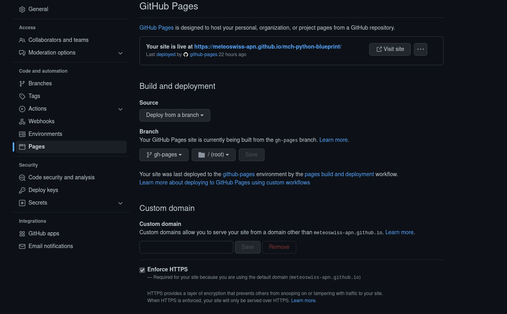

*************
Documentation
*************

Documentation template in the docs folder
-----------------------------------------

Additionally to a initial README.rst file, the blueprint will automatically generate a folder with the following content

.. code:: console

    docs/
    authors.rst
    conf.py
    contributing.rst
    history.rst
    index.rst
    installation.rst
    make.bat
    Makefile
    modules.rst
    readme.rst
    usage.rst

This folder is set up to build static html pages with sphinx. Some files link to the markdown files in the root directory.
Special mention should be made of the file `modules.rst`. It contains a directive which triggers automatic documentation builds
from the docstrings in your modules. Initially, only the example code is listed. If you want to auto-build from docstrings, add your
modules there. To deploy your docs to GitHub-Pages, enable the feature in the settings of your repository following the example
given in the following figure:

In the docs folder, there is a file (documentation.inactive), which manages the corresponding Github action. To use it,
add the last line of this block at the very bottom of the file:

.. code:: yaml

    with:
        force: true
        branch: gh-pages
        directory: gh-pages
        github_token: ${{ secrets.GITHUB_TOKEN }}

and then move it to the other GH action workflow file

.. code:: bash

    mv documentation.inactive ../.github/workflows/documentation.yaml

Note that this is an optional feature. If you repository is private, you should probably not push the documentation to
Github-Pages. Likewise, if you work on a small project, you might not necessarily need this feature. If you do not need
the feature, you can link individual files directly to the readme in the root directory. In this case remove sphinx from
your `requirements/requirements.yml` file and remove the GH action (.github/workflows/documentation).
